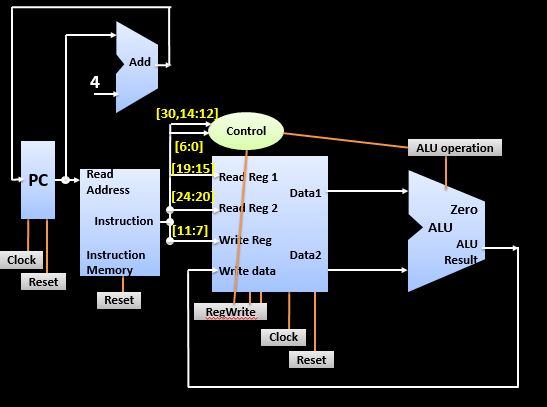

# RISC-V-Processor

<!-- PROJECT SHIELDS -->
<!--
*** I'm using markdown "reference style" links for readability.
*** Reference links are enclosed in brackets [ ] instead of parentheses ( ).
*** See the bottom of this document for the declaration of the reference variables
*** for contributors-url, forks-url, etc. This is an optional, concise syntax you may use.
*** https://www.markdownguide.org/basic-syntax/#reference-style-links
-->
<!-- [![Contributors][contributors-shield]][contributors-url]
[![Forks][forks-shield]][forks-url]
[![Stargazers][stars-shield]][stars-url]
[![Issues][issues-shield]][issues-url]
[![MIT License][license-shield]][license-url]
[![LinkedIn][linkedin-shield]][linkedin-url] -->

<!-- PROJECT LOGO -->
<!-- ABOUT THE PROJECT -->
## About The Project

In this project we implement a 32-bit, RISC-V ISA based processor in verilog. The sub-modules that are used and their interaction with each other are shown in the following picture.

    
     
     
    
Output waveform using GTKWave:
    

    

    
    

 

### Project Structure:

* Each sub-unit that has been created has its own folder in root of the repository.
* This sub-unit folder comprises of the modules used in that particular unit.
* Additionally it consists of testbench and waveform used for testing and debugging those modules.
* The final processor implementation is in the folder called "Processor". 
* This uses all the relevent units created individually and integrates them to give us our working processor.

## Tools Used

### [iVerilog](https://github.com/steveicarus/iverilog): 

While there are many compilers for verilog present, not many of them are open source, and even fewer are robust, user-friendly and updated regularly. [Icarus Verilog](https://github.com/steveicarus/iverilog) checks all boxes and can be learnt easily with this really [helpful wiki](https://iverilog.fandom.com/wiki/Main_Page) setup for it.

### [GTKWave](https://sourceforge.net/projects/gtkwave/files/):

Another really powerful open source tool that was essential in building this project was [GTKWave](https://github.com/gtkwave/gtkwave). It helps to view vcd and other waveforms. Really important for debugging and understanding if dependencies of different signals are as described by you.

<!-- USAGE EXAMPLES -->
<!-- ## Usage

Use this space to show useful examples of how a project can be used. Additional screenshots, code examples and demos work well in this space. You may also link to more resources.

_For more examples, please refer to the [Documentation](https://example.com)_ -->

<!-- ROADMAP -->
<!-- ## Roadmap

See the [open issues](https://github.com/othneildrew/Best-README-Template/issues) for a list of proposed features (and known issues).

<!-- CONTRIBUTING -->
<!-- ## Contributing

Contributions are what make the open source community such an amazing place to be learn, inspire, and create. Any contributions you make are **greatly appreciated**.

1. Fork the Project
2. Create your Feature Branch (`git checkout -b feature/AmazingFeature`)
3. Commit your Changes (`git commit -m 'Add some AmazingFeature'`)
4. Push to the Branch (`git push origin feature/AmazingFeature`)
5. Open a Pull Request --> 